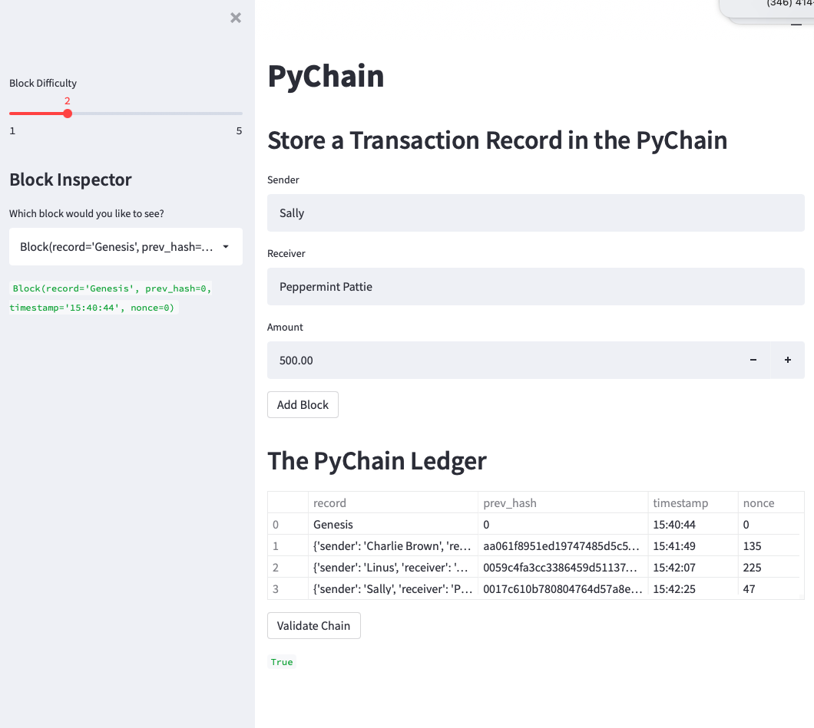
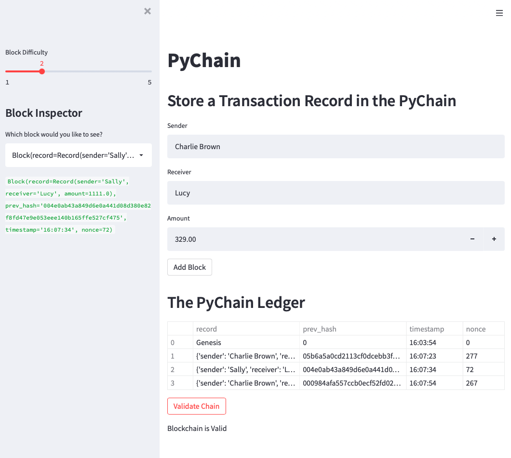

# Blockchain Transactions

This project builds a blockchain record storage system that validates the hash for prior records.  Additionally, the project contains a Streamlit interface for users to add records, verify records, and validate the blockchain.    

---

## Technologies

**This application requires StreamLit.  Install before proceeding.**

This application is a .py file and should be viewed in Terminal.  Additionally, the application can be viewed in a web browswer by navigating to the file location where the pychain.py is located and entering the following command `streamlit run pychain.py`.

This notebook requires the following imports.  Depending on your installed library, you may need to install some python libraries.

-import streamlit as st
-from dataclasses import dataclass
-from typing import Any, List
-import datetime as datetime
-import pandas as pd
-import hashlib

---

## Usage

Once the code is running, the Streamlit user interface is relatively straight forward.  As seen below, the user can enter a transaction to be added to the block chain.  Below the input portion of the screen is a table that contains the current blockchain entries along with the previous hash and time stamp.  By clicking the validate button, the user can validate the entire blockchain, returning True.

In addition, the application allows for the inspection of any particular record in the blockchain as seen in the screenshot below.

---

## Contributors

This project was created as a part of the Rice FinTech Bootcamp.

---

## License

This software is licensed for use under the included MIT License.
